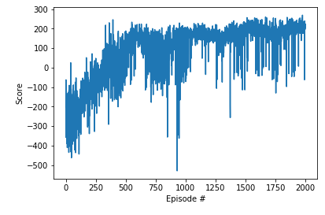
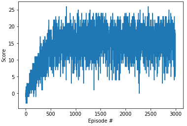

# Deep-Reinforcement-Learning-Exercises

## Value-Based Methods:

#### Deep Q Network on OpenAI Gym LunarLander-v2

- `model.py`: create a Q-Network with states size of the game as input and actions size as output.
- `dqn_agent.py`: definition of an DQN agent (step, act, learn and update) and a replay buffer.
- `Deep_Q_Network.ipynb`: instantiation of the environment and training of DQN agent.

Learning process:

Smart agent in action:

#### Deep Q Network on Unity banana collector:

- `model.py`: create a Q-Network with states size of the game as input and actions size as output.
- `dqn_agent.py`: definition of an DQN agent (step, act, learn and update) and a replay buffer.
- `Navigation.ipynb`: instantiation of the environment and training of DQN agent.

Learning process:

## Policy-Based Methods
