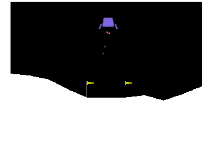
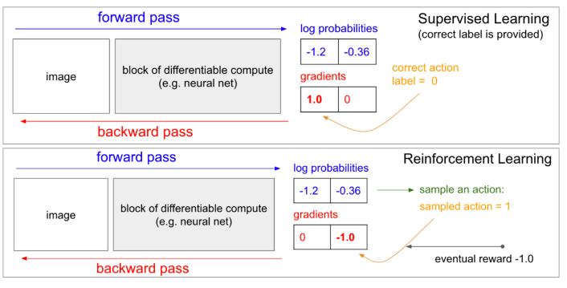

# Deep-Reinforcement-Learning-Exercises

# Value-Based Methods:

Deep Q-Learning Algorithm paper can be find [here](https://web.stanford.edu/class/psych209/Readings/MnihEtAlHassibis15NatureControlDeepRL.pdf).

Several improvements to the original Deep Q-Learning algorithm can be suggested such as:

- Double DQN: Deep Q-Learning tends to overestimate action values as shown [here](https://www.ri.cmu.edu/pub_files/pub1/thrun_sebastian_1993_1/thrun_sebastian_1993_1.pdf). Double Q-Learning has been shown to work well in practice to help with this as explained [here](https://arxiv.org/abs/1509.06461).

- Prioritized Experience Replay: Deep Q-Learning samples experience transitions uniformly from a replay memory. Prioritized experienced replay is based on the idea that the agent can learn more effectively from some transitions than from others, and the more important transitions should be sampled with higher probability, details can be find [here](https://arxiv.org/abs/1511.05952).

- Dueling DQN: Currently, in order to determine which states are (or are not) valuable, we have to estimate the corresponding action values for each action. However, by replacing the traditional Deep Q-Network (DQN) architecture with a dueling architecture as shown [here](https://arxiv.org/abs/1511.06581), we can assess the value of each state, without having to learn the effect of each action.

#### Deep Q Network on OpenAI Gym [LunarLander-v2](https://gym.openai.com/envs/LunarLander-v2/):

- `model.py`: create a Q-Network with states size of the game as input and actions size as output.
- `dqn_agent.py`: definition of an DQN agent (step, act, learn and update) and a replay buffer.
- `Deep_Q_Network.ipynb`: instantiation of the environment and training of DQN agent.

Learning process:

#### Deep Q Network on [Unity banana collector](https://github.com/Unity-Technologies/ml-agents/blob/master/docs/Learning-Environment-Examples.md):

- `model.py`: create a Q-Network with states size of the game as input and actions size as output.
- `dqn_agent.py`: definition of an DQN agent (step, act, learn and update) and a replay buffer.
- `Navigation.ipynb`: instantiation of the environment and training of DQN agent.

Learning process:

# Policy-Based Methods

- With value-based methods, the agent uses its experience with the environment to maintain an estimate of the optimal action-value function. The optimal policy is then obtained from the optimal action-value function estimate.
- Policy-based methods directly learn the optimal policy, without having to maintain a separate value function estimate.

#### Why Policy-Based Methods?

- Simplicity: Policy-based methods directly get to the problem at hand (estimating the optimal policy), without having to store a bunch of additional data (i.e., the action values) that may not be useful.
- Stochastic policies: Unlike value-based methods, policy-based methods can learn true stochastic policies.
- Continuous action spaces: Policy-based methods are well-suited for continuous action spaces.

### Policy function approximation: 

In deep reinforcement learning, it is common to represent the policy with a neural network.
- This network takes the environment state as input.
- If the environment has discrete actions, the output layer has a node for each possible action and contains the probability that the agent should select each possible action.

The weights in this neural network are initially set to random values. Then, the agent updates the weights as it interacts with (and learns more about) the environment.

The principle:

#### Hill Climbing on CartPole-v0:

Hill climbing is an iterative algorithm that can be used to find the weights θ for an optimal policy.

At each iteration:

- We slightly perturb the values of the current best estimate for the weights θ_best, to yield a new set of weights.
- These new weights are then used to collect an episode. If the new weights θ_new resulted in higher return than the old weights, then we set θ_best ← θ_new.

Using Hill Climbing method to optimize the weights for simple linear policy: state_space x action_space, to solve a continuous action spaces environment.

Learning process:

#### Beyond Hill Climbing:

- Steepest ascent hill climbing is a variation of hill climbing that chooses a small number of neighboring policies at each iteration and chooses the best among them.
- Simulated annealing uses a pre-defined schedule to control how the policy space is explored, and gradually reduces the search radius as we get closer to the optimal solution.
- Adaptive noise scaling decreases the search radius with each iteration when a new best policy is found, and otherwise increases the search radius.

#### More Black-Box Optimization:

- The cross-entropy method iteratively suggests a small number of neighboring policies, and uses a small percentage of the best performing policies to calculate a new estimate.
- The evolution strategies technique considers the return corresponding to each candidate policy. The policy estimate at the next iteration is a weighted sum of all of the candidate policies, where policies that got higher return are given higher weight.

#### Cross-Entropy Method on [MountainCarContinuous v0](https://github.com/openai/gym/wiki/MountainCarContinuous-v0):

Using the [cross entropy method](https://en.wikipedia.org/wiki/Cross-entropy_method) to optimize the weights of the policy network in order to maximize the reward, we will solve a continuous action spaces environment by directly estimating the policy.

Learning process:

### Poilicy Gradient Methods:

The way we need to update weights in the policy gradient method can be compare with supervised learning, more details about this can be found on this famous [blogpost](http://karpathy.github.io/2016/05/31/rl/).

### Reinforce

First, we use an environment with a discrete action space ([OpenAI Gym's CartPole environment](https://gym.openai.com/envs/CartPole-v0/)).

Let's now dive in the REINFORCE algorithm:

REINFORCE increases the probability of "good" actions and decreases the probability of "bad" actions.([source](https://openai.com/blog/evolution-strategies/))

#### How to have a better understanding of each action result than the global policy result:

