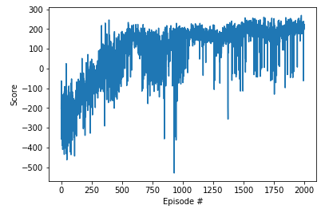

# Deep-Reinforcement-Learning-Exercises

## Value-Based Methods:

Deep Q-Learning Algorithm paper can be find [here](https://web.stanford.edu/class/psych209/Readings/MnihEtAlHassibis15NatureControlDeepRL.pdf).

Several improvements to the original Deep Q-Learning algorithm can be suggested such as:

- Double DQN: Deep Q-Learning tends to overestimate action values as shown [here](https://www.ri.cmu.edu/pub_files/pub1/thrun_sebastian_1993_1/thrun_sebastian_1993_1.pdf). Double Q-Learning has been shown to work well in practice to help with this as explained [here](https://arxiv.org/abs/1509.06461).

- Prioritized Experience Replay: Deep Q-Learning samples experience transitions uniformly from a replay memory. Prioritized experienced replay is based on the idea that the agent can learn more effectively from some transitions than from others, and the more important transitions should be sampled with higher probability, details can be find [here](https://arxiv.org/abs/1511.05952).

- Dueling DQN: Currently, in order to determine which states are (or are not) valuable, we have to estimate the corresponding action values for each action. However, by replacing the traditional Deep Q-Network (DQN) architecture with a dueling architecture as shown [here](https://arxiv.org/abs/1511.06581), we can assess the value of each state, without having to learn the effect of each action.

#### Deep Q Network on OpenAI Gym LunarLander-v2

- `model.py`: create a Q-Network with states size of the game as input and actions size as output.
- `dqn_agent.py`: definition of an DQN agent (step, act, learn and update) and a replay buffer.
- `Deep_Q_Network.ipynb`: instantiation of the environment and training of DQN agent.

Learning process:

Smart agent in action:

#### Deep Q Network on Unity banana collector:

- `model.py`: create a Q-Network with states size of the game as input and actions size as output.
- `dqn_agent.py`: definition of an DQN agent (step, act, learn and update) and a replay buffer.
- `Navigation.ipynb`: instantiation of the environment and training of DQN agent.

Learning process:

## Policy-Based Methods
